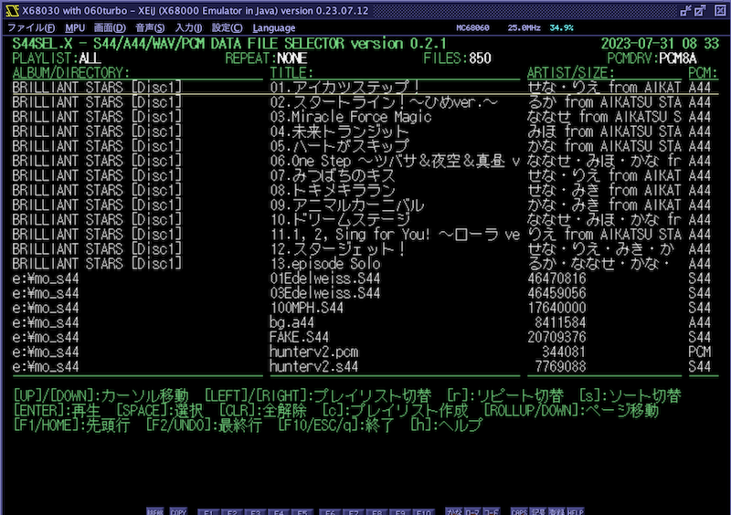

# S44SEL.X

S44/A44/WAV/PCM Data Selector for Human68k/X680x0

---

## About This

S44/A44/WAV/PCMデータファイルのセレクタ兼プレーヤです。

 - 複数のドライブ・ディレクトリを一括して一つのプールとして管理
 - KMD歌詞表示・タグ表示対応
 - プレイリスト対応
 - リピート再生対応

---

## 動作環境

MercuryUnitが装着されていることが望ましい。

MercuryUnitが無い場合は16bitPCMデータをADPCMに変換しながら再生するためX68030(25MHz)程度のMPUパワーが必要になります。

---

#### PCMドライバ

PCMドライバとして、PCM8A.X または PCM8PP.X が必須です。
いずれも組み込まれていない場合は起動エラーとなります。

PCM8PPを組み込む際には、`-c1` をつけた1ch固定モードを推奨します。

---

#### PCMプレーヤ

拙作 S44EXP.X version 1.2.6 以上が必要です。子プロセスで呼び出す形となります。

* [S44EXP.X](https://github.com/tantanGH/s44exp)

パスの通った場所に導入しておいてください。

---

#### SCSIドライバ

SCSIディスクからMercuryUnitで逐次再生する場合、HSCSIを必ず組み込む必要があります。

* [HSCSI.X](http://retropc.net/x68000/software/disk/scsi/hscsi/)

組み込んでいない場合はプチノイズが発生することがあります。

---

## インストール

S44SLxxx.ZIP をダウンロードして、S44SEL.X をパスの通ったディレクトリにコピーします。

以下の2つの環境変数を設定しておきます。

- S44SEL_DATA_PATH ... S44/A44/WAV/PCMデータファイルを格納してあるディレクトリ名をセミコロン(;)で区切って連結したもの。ディレクトリは再帰的にスキャンされます。

- S44SEL_LIST_PATH ... プレイリストファイル(*.PCL)を格納するディレクトリ名。1つだけ指定可能。ディレクトリの再帰スキャンは行いません。

例：

    SET S44SEL_DATA_PATH=G:\S44_DATA;H:\A44_DATA;I:\WAV_DATA;J:\PCM_DATA
    SET S44SEL_LIST_PATH=D:\S44_LIST

---

## PCMプレイリストファイル(*.PCL)

単にS44/A44/WAV/PCMファイルのフルパス名を1行に1つずつ記述したテキストファイルです。
作成の方法は2通りあります。

1. テキストエディタで作成

ファイル名がプレイリスト名として扱われます。

2. S44SEL上で作成

スペースキーでファイルを選択し、`c`キーを押すと新規プレイリストを作成することができます。

再生順はファイルに記載した順となります。

---

## 利用方法

必要なドライバと環境変数を設定した上で、

    s44sel

で起動します。条件に不足があった場合は起動エラーとなりますのでメッセージを確認してください。

コマンドラインオプションもいくつかありますが、詳細は `-h` で表示されるヘルプを参照してください。

起動直後の画面は上記のようになります。

- 1行目 ... アプリケーションのバージョン、PhantomXの場合はSoC温度、日付と時刻
- 2行目 ... 現在選択されているプレイリスト名、現在のリピートモード、ファイル数、PCMドライバの種類
- 4行目以降 ... ファイルのリスト
- 下段部 ... 操作説明

起動直後はプレイリスト"ALL"となっています。これは`S44SEL_DATA_PATH`で指定したディレクトリ全体からスキャンしたすべてのS44/A44/WAV/PCMファイルがリストされます。
プレイリストはカーソルの左右で切り替えが可能です。

カーソルバーはカーソルキーの上下で動かせます。その他ページ送りやリスト先頭・末尾へのジャンプなどもありますのでヘルプメッセージを参照してください。
なお、ヘルプに書かれていませんが、emacsキーバインドおよびviキーバインドの一部も対応しています。

リターンキーを押すと選択されているデータを再生します。

---

`r`キーを押すとリピートモードを切り替えることができます。(詳細後述)

`s`キーを押すとソート順を切り替えることができます。

`h`キーを押すと起動直後に表示されるものと同じ操作方法のヘルプを下段部に表示します。

`ESC`キー、`q`キー、F10キーのいずれかで終了します。

---

## リピート再生

`r`キーを押すたびに、リピートモードを切り替えることができます。
NONE -> ALBUM -> SHUFFLE -> SINGLE -> SINGLE2 -> SINGLE3 -> NONE -> ... と押すたびに切り替わります。

- NONE ... リピートしません。1回だけ再生します。(MACSデータ内部でループが設定されている場合はそれに従ってループします)

- ALBUM ... 再生終了後、リスト上の次のMCSデータを順番に1回ずつ再生します。リストの最後までいくと先頭に戻って繰り返します。

- SHUFFLE ... 再生終了後、リスト上のMCSデータをランダムに1回ずつ再生します。

- SINGLE ... 同一MCSを無限回リピートします。

- SINGLE2 ... 同一MCSを2回再生します。

- SINGLE3 ... 同一MCSを3回再生します。

いずれのモードであっても、`ESC`で再生キャンセルするか、`SHIFT`でロードキャンセルするとリピート動作を停止します。

---

## 動作確認環境

以下でのみ動作確認しています。

- X68000XVI 実機 + PhantomX 1.02c (68030モード) + Mercury Unit V3 + PCM8PP.X
- XEiJ (68060モード) + 060turbo.sys + PCM8A.X

---

## History

* 0.2.1 (2023/07/31) ... 初版
